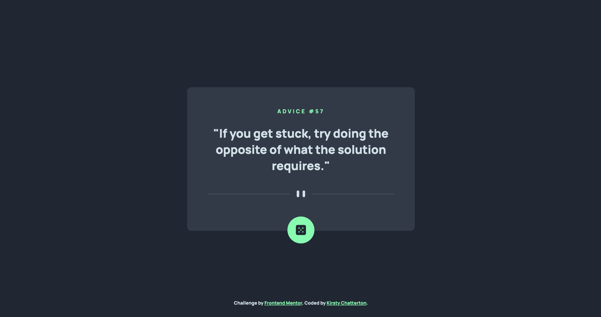

# Frontend Mentor - Advice generator app solution

This is a solution to the [Advice generator app challenge on Frontend Mentor](https://www.frontendmentor.io/challenges/advice-generator-app-QdUG-13db). Frontend Mentor challenges help you improve your coding skills by building realistic projects.

## Table of contents

- [The challenge](#the-challenge)
  - [Screenshot](#screenshot)
  - [Links](#links)
- [Built with](#built-with)
- [Author](#author)

## The challenge

Users should be able to:

- View the optimal layout for the app depending on their device's screen size
- See hover states for all interactive elements on the page
- Generate a new piece of advice by clicking the dice icon

### Screenshot

### Links

- Solution URL: [Add solution URL here](https://your-solution-url.com)
- Live Site URL: [https://kirstchat.github.io/advice-generator-app-main/](https://kirstchat.github.io/advice-generator-app-main/)

## Built with

- Semantic HTML5 markup
- CSS custom properties
- Flexbox
- Vanilla JavaScript
- GSAP Animation Tools
- Mobile-first workflow

### Useful resources

- [GreenSock](https://greensock.com/docs/v3/GSAP/gsap.fromTo()) - The gsap.fromTo() tween was used to add animation to text to fade in when a user clicks the button to generate new advice.

## Author

- Frontend Mentor - [@KirstChat](https://www.frontendmentor.io/profile/KirstChat)
- LinkedIn - [Kirsty Chatterton](https://www.linkedin.com/in/kirsty-c-154781a4/)
